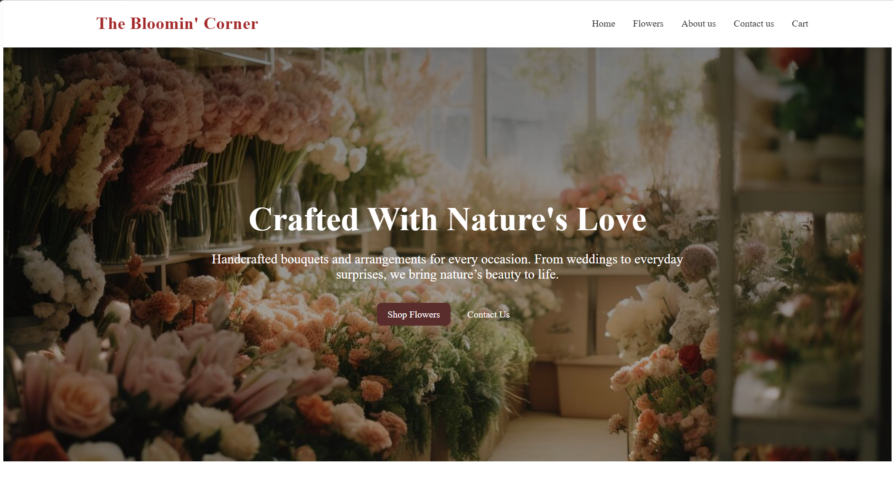
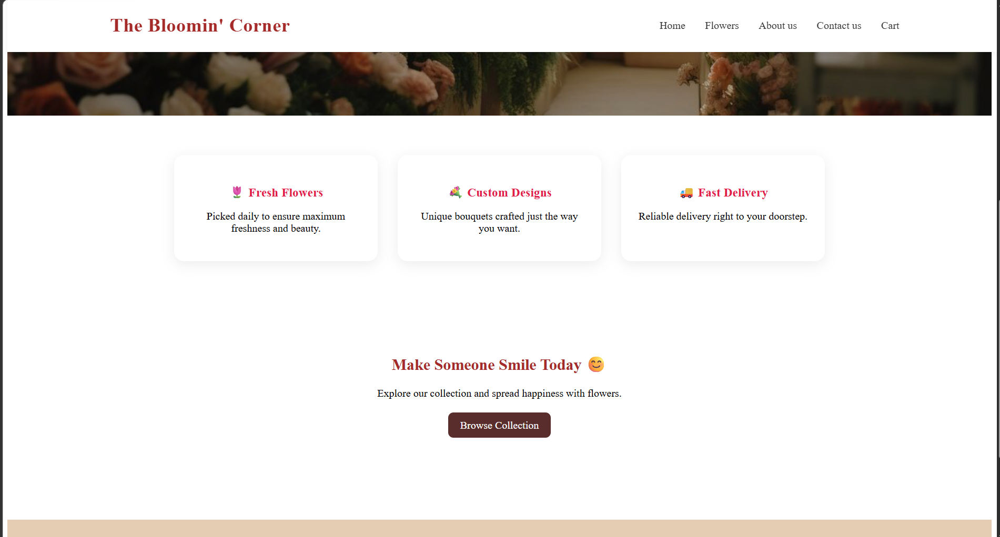
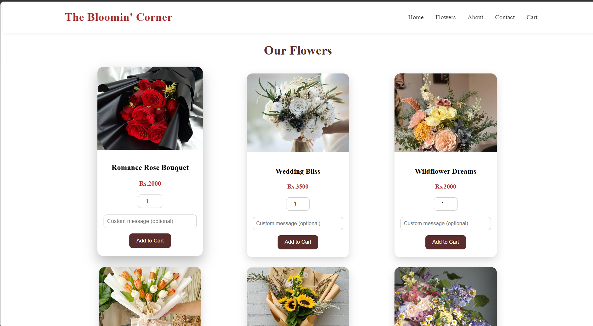
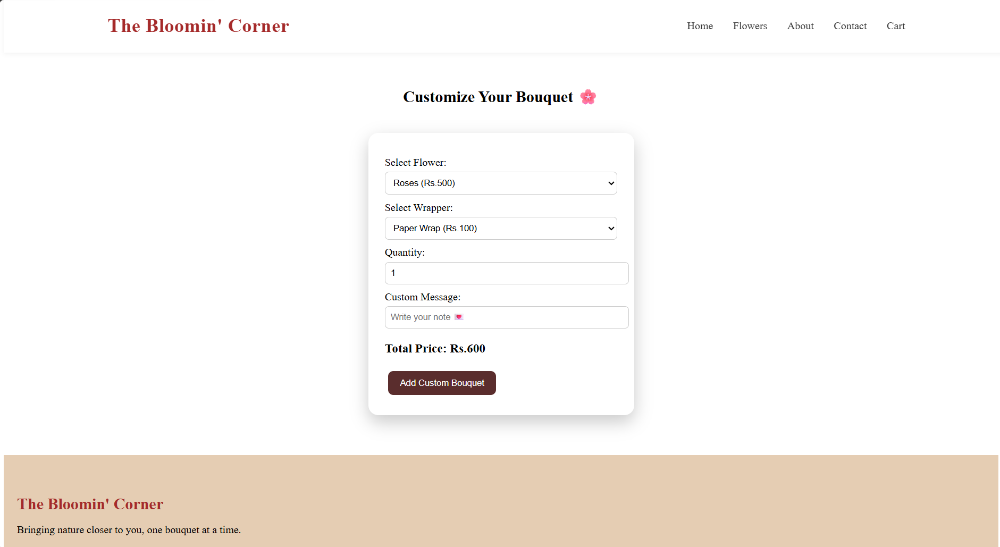
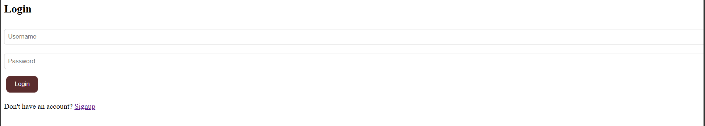
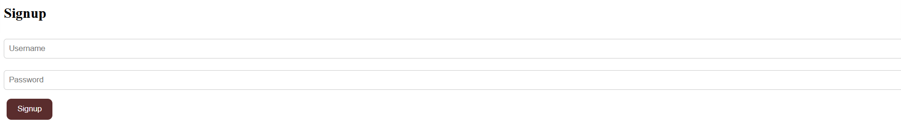

# The Bloomin' Corner — Floral Shopping Website

A multi-page floral e-commerce website built as part of a Web Programming course. Users can sign up, log in, browse flower collections, customize their own bouquets, add items to cart and checkout — all in a warm, elegant UI with consistent branding.

---

## Preview

### Homepage


### Features Section


### Our Flowers


### Customize Your Bouquet


### Login Page


### Signup Page


---

## Features

- **User Authentication** — Signup and Login with credential validation; protected pages redirect to login if not logged in
- **Hero Landing Page** — full-width floral banner with animated fade-in, Shop Flowers and Contact Us buttons
- **Feature Highlights** — Fresh Flowers, Custom Designs and Fast Delivery cards with hover animations
- **Flower Shop** — 8 product cards in a responsive grid, each with image, name, price, quantity selector, optional custom message and Add to Cart
- **Customize Your Bouquet** — select flower type and wrapper style from dropdowns with a live total price calculator, quantity input and personal note field
- **Shopping Cart** — displays all added items with quantities, messages and individual totals, plus a grand total and Checkout button
- **Contact Page** — contact form with name and email validation, plus business info (address, phone, email, hours, socials)
- **About Page** — company story, mission and vision, core values grid, business stats (1000+ customers, 250+ weddings), meet the team section and customer promise
- **Smooth Animations** — hero fade-in on load, navbar underline hover effect, card hover lift effects throughout
- **Responsive Design** — fluid grid layouts that adapt to all screen sizes
- **Consistent Branding** — deep maroon and warm beige color palette with fixed navbar across all pages

---

## Built With


---

## Project Structure

```
floral-website/
│
├── index.html        # Homepage — hero, features, browse CTA, footer
├── flowers.html      # Flower shop grid + Customize Your Bouquet section
├── cart.html         # Shopping cart with item list, totals and checkout
├── login.html        # Login page with credential check
├── signup.html       # Signup page with localStorage registration
├── about.html        # About page — story, mission, values, team, stats
├── contact.html      # Contact form with validation + business info
│
├── style.css         # All styles — layout, animations, responsive grid
└── script.js         # All JS — auth, cart, price calculator, validation
```

---

## How It Works

### Authentication
- On Signup, username and password are saved to `localStorage`
- On Login, entered credentials are matched against stored values
- Pages like `flowers.html` and `cart.html` call `checkLogin()` on load and redirect to login if the user is not authenticated

### Cart System
- Each flower card has a quantity input and optional custom message
- `addToCart()` saves items as objects `{ name, price, quantity, message }` to `localStorage`
- `displayCart()` reads the cart and renders each item with its total
- `checkout()` clears the cart after placing the order

### Bouquet Customizer
- Dropdowns for flower type and wrapper style each carry a price value
- `updatePrice()` recalculates total as `(flower + wrapper) × quantity` on every change
- The custom bouquet is added to the same cart as regular items

---

##  How to Run Locally

1. Clone or download this repository
2. Open `index.html` in any web browser
3. No installations or dependencies needed — it runs entirely in the browser!

---

## About This Project

This project was built as part of the Web Programming course during my BCA degree. It demonstrates skills in multi-page website structure, CSS animations and responsive layouts, JavaScript DOM manipulation, localStorage for state management, form validation and protected page routing.

---

## Author

**Felicita Tanya Miranda**
[](https://www.linkedin.com/in/felicita-tanya)
[](mailto:felicitatanyamiranda@gmail.com)
